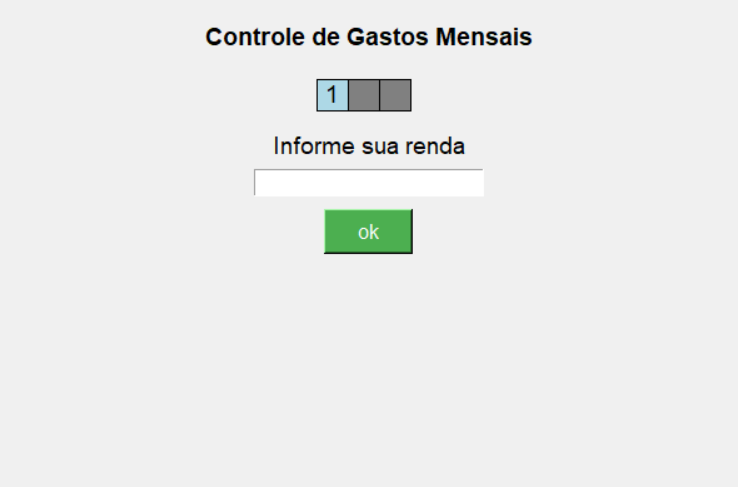
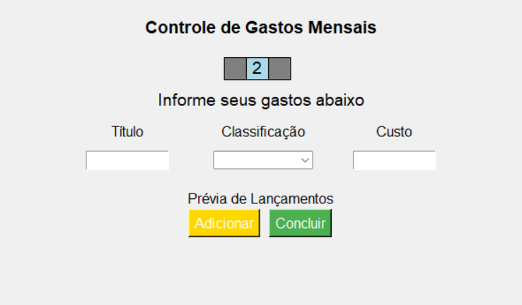
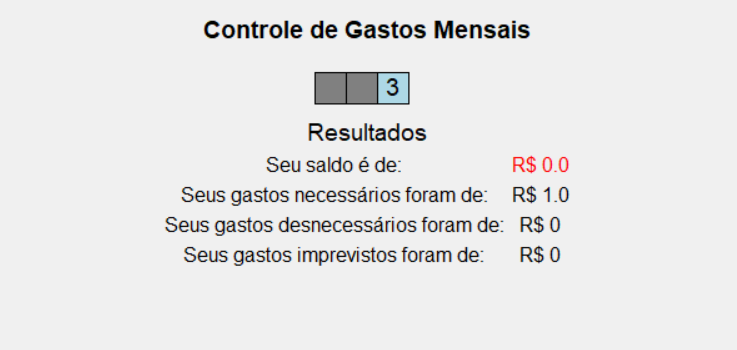

# 🧮 Calculadora Financeira

Uma calculadora de gastos mensais feita com **Python** e **Tkinter**, com interface gráfica interativa, validação de dados e categorização de despesas. Ideal para usuários que desejam acompanhar seu orçamento de forma simples e direta.

---

## 📦 Funcionalidades

- Interface gráfica intuitiva  
- Entrada de **renda mensal**  
- Registro de despesas por categoria:
  - ✅ Necessário
  - ⚠️ Imprevisto
  - ❌ Desnecessário
- Visualização de uma **prévia dos lançamentos**
- **Cálculo automático** de:
  - Total por categoria
  - Saldo restante (com coloração verde ou vermelha)
- Reset automático dos campos após cada adição

---

## 🖼️ Capturas de Tela
### Tela Inicial

### Tela de Gasto com Prévia

### Tela de Resultados

